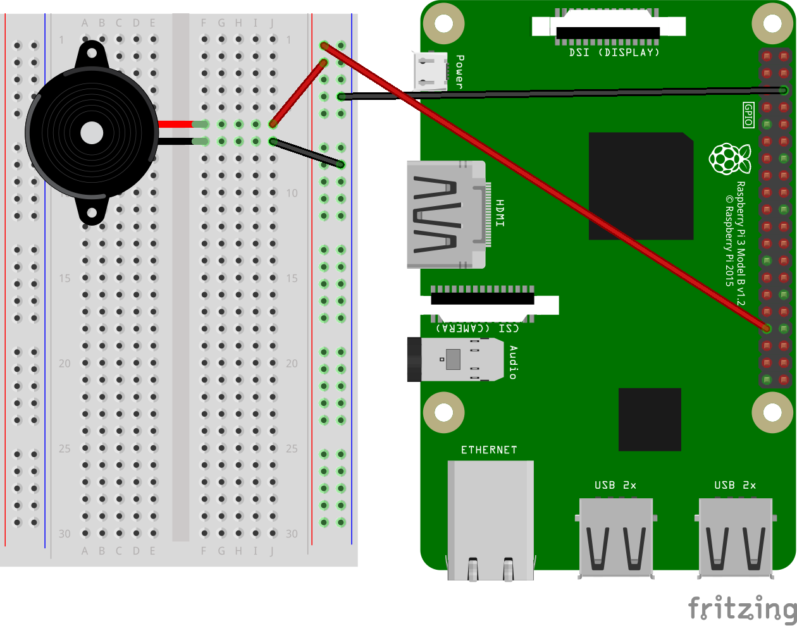

# Distributed Piano on Android Things

This code sample allows users to run a distributed piano on mulitple devices, which all connect to a device running Android Things dev preview.
The Android Things device has a speaker plugged in to receive and play the notes from all the different devices.

This code sample uses Google Nearby API to send notes to the Raspberry Pi 3. Please also note that this has only been tested on a Raspberry Pi 3, but should work on other boards too.

##Setup
1. Checkout this repository. 
2. Setup your Raspberry Pi 3 in the following way:

3. Open repository in Android Studio
4. Run "app" and deploy onto Raspberry Pi.
5. Deploy "pianoplayer" onto your devices that you want to be able to play piano on.
6. Make sure all devices are on the same WiFi network. You should see a toast display in the app when the device is connected to the Raspberry Pi. You should then be able to play music! 

#Referenced Libraries/Projects
1. Google-Samples for the KeyboardView. This repository can be found here: 
https://github.com/google/music-synthesizer-for-android/
2. Android Things Drivers for Speaker https://github.com/androidthings/contrib-drivers 